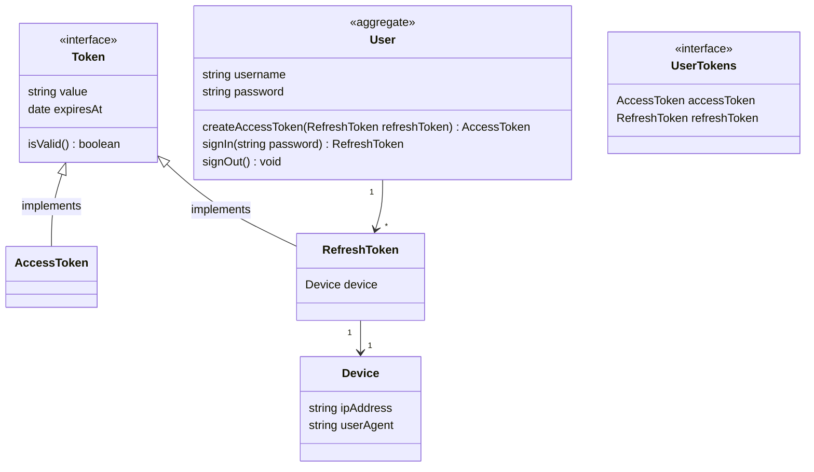
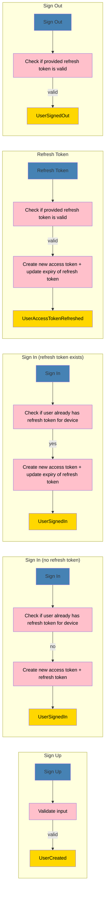

# User Module JWT

This is a module for user management/authentication. This is made for educational purposes.

## Setting up the development database

You can use Docker to set up the database in development with the following command:

```sh
docker run \
  -p 0.0.0.0:5000:5432 \
  --name user-module-jwt-db \
  -e POSTGRES_PASSWORD=root \
  -e POSTGRES_USER=root \
  -e POSTGRES_DB=user \
  -d postgres:12-alpine
```

```sh
docker run \
  -p 0.0.0.0:5001:6379 \
  --name user-module-jwt-redis \
  -d redis:6-alpine
```

This wil create a postgres 12 container accesible at localhost port `5000`. This command only needs to be run once. Afterward running `yarn dev` will reuse this container.

## Stories

-   [x] A user can be created (signed up) by providing a username and password (additional information might be added later)
-   [x] A user can exchange its credentials (username and password) for an access token and a refresh token (sign in)
-   [x] A user can exchange its refresh token for a new access token (refresh token)
-   [x] A user can invalidate its refresh token (sign out)
-   [x] The user information of the currently logged in user can be queried (get user by id &lt;-- access token)





## Todo's

-   [ ] Make all events serializable by default - remove serializePayload methods
-   [ ] Make all domain errors custom so they can be catched in application layer
-   [ ] Make a config file where all environment variables are imported + move as much config as possible to DIContainer
