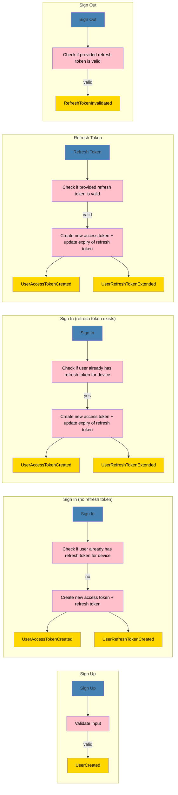

\*\*\*\*# User Module JWT

This is a module for user management/authentication. This is made for educational purposes.

## Stories

-   [x] A user can be created (signed up) by providing a username and password (additional information might be added later)
-   [ ] A user can exchange its credentials (username and password) for an access token and a refresh token (sign in)
-   [ ] A user can exchange its refresh token for a new access token (refresh token)
-   [ ] A user can invalidate its refresh token (sign out)
-   [ ] The user information of the currently logged in user can be queried (get user by refresh token)

